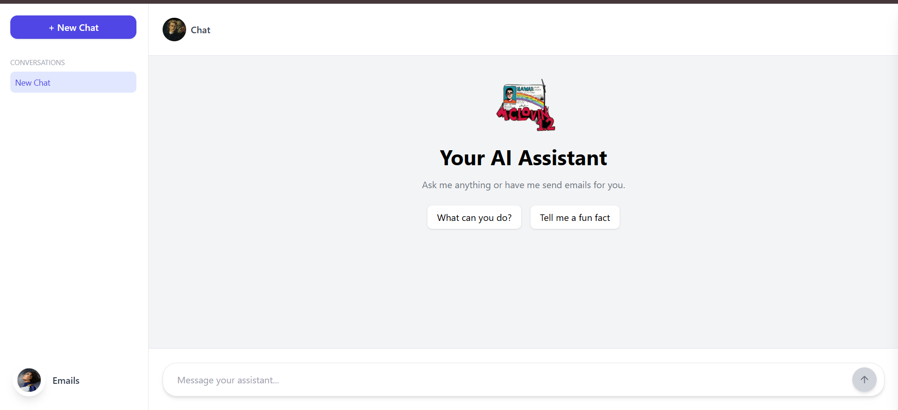
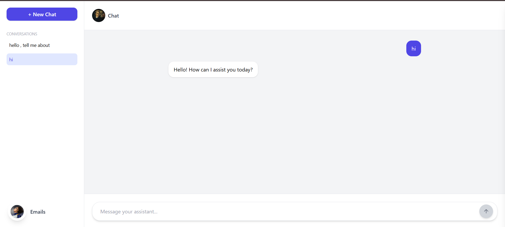
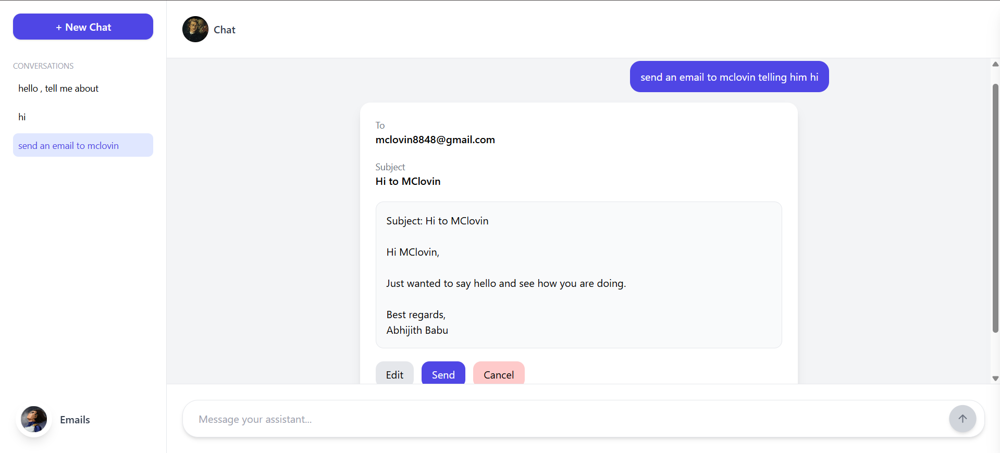
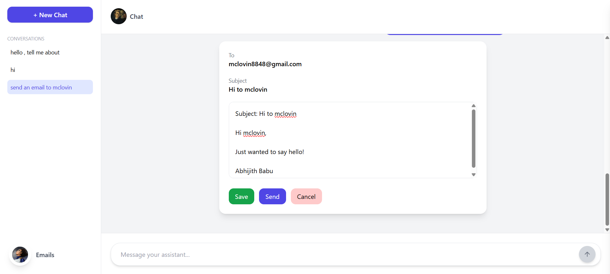
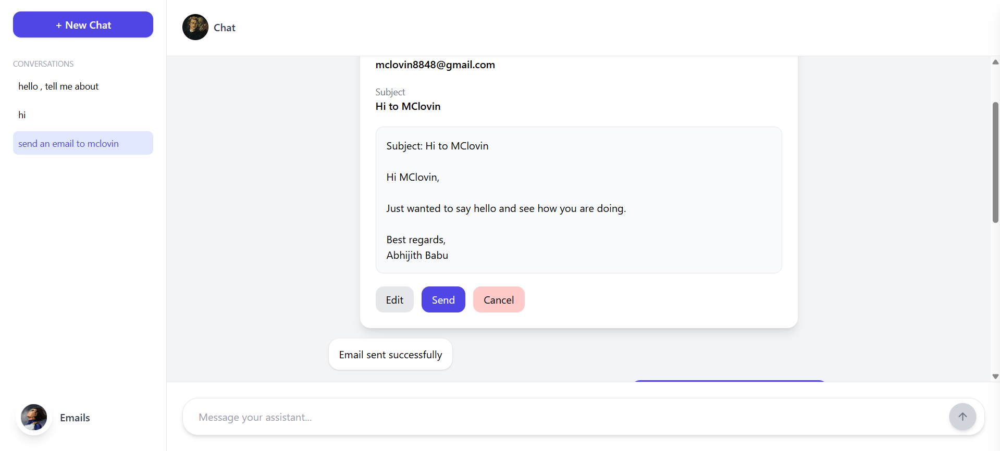
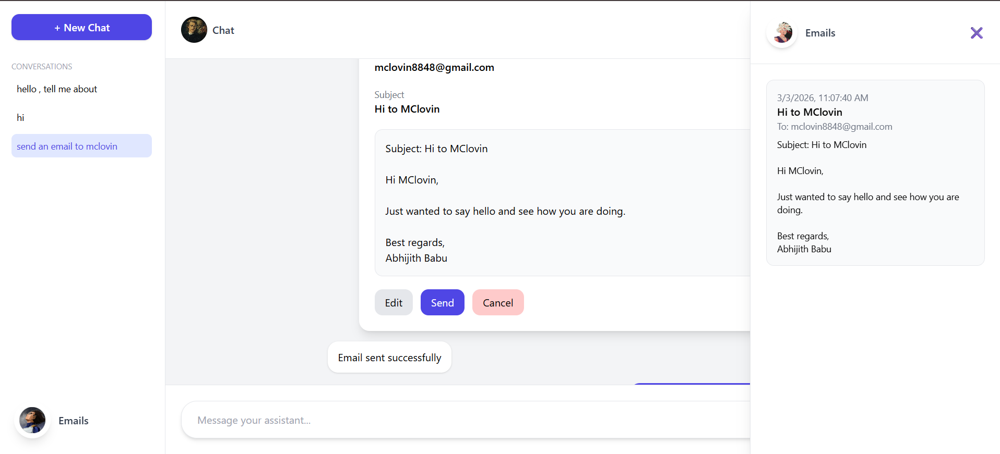

# 🚀 Agentic AI Mail Assistant

An end-to-end **Agentic AI Email System** powered by a 7B LLM that can:

- 💬 Stream real-time chat responses  
- 📧 Automatically generate structured emails  
- ✏ Edit email drafts inline  
- 📤 Send emails using Gmail API  
- 🧠 Retrieve contacts using vector search (Qdrant)  
- 📬 Maintain sent email history  
- 📱 Fully responsive UI  

🌍 **Live Demo:** [agentic-ai-frontend-red.vercel.app](agentic-ai-frontend-red.vercel.app)
---

## 🧠 Architecture Overview

### 🔹 Frontend
- React (Vite)
- Tailwind CSS
- Deployed on **Vercel**
- Real-time token streaming UI
- Draft state management

### 🔹 Backend
- FastAPI
- Qwen 2.5 7B (4-bit quantized)
- HuggingFace Transformers
- Qdrant (Vector Database)
- Sentence Transformers
- Gmail API Integration
- Running on **Google Colab**

---

## ⚡ Performance

| Feature | Latency |
|----------|---------|
| Chat First Token | ~2 seconds |
| Email Generation | 4–7 seconds |
| Model | Qwen 7B (4-bit quantized) |

Measured via backend timing logs and browser network profiling.

---

## 🖼 Screenshots
### 🏠 Landing Page


### 💬 Chat Streaming


### 📧 Email Draft


### ✏ Edit Email


### 📤 Email Sent


### 📬 Sent Emails Panel


---

# 🛠 How It Works

1. User sends a message.
2. Backend detects intent:
   - Chat → streaming LLM response.
   - Email → intent extraction + contact retrieval.
3. Email draft is generated.
4. User can:
   - Edit inline
   - Send via Gmail API
   - Cancel
5. Sent emails stored in frontend state.

---

# 🔐 Gmail API Setup (OAuth)

### Step 1: Go to Google Cloud Console  
https://console.cloud.google.com/

### Step 2: Create a New Project

### Step 3: Enable Gmail API  
APIs & Services → Enable APIs → Search **Gmail API**

### Step 4: Create OAuth Credentials

APIs & Services → Credentials → Create Credentials → OAuth Client ID  

Choose:
- Application type: **Desktop App**

Download the file and rename it to: **credentials.json**

---
# 📇 contact.json File

This file stores your contact database for semantic search.

Example:

```json
[
  {
    "name": "John Doe",
    "email": "john@example.com",
    "phone": "+123456789"
  },
  {
    "name": "Madmen",
    "email": "madmen@gmail.com",
    "phone": "+987654321"
  }
```
# The system uses:

🔴Sentence Transformers embeddings

🔴 Qdrant vector DB

🔴 Semantic similarity search

---
# 🚀 Running Backend on Google Colab

**Step 1: Run requirements:**

```
# ---------------------------
# Clean previous installs
# ---------------------------
!pip uninstall -y langchain langchain-core langchain-community langchain-huggingface \
torch torchvision torchaudio bitsandbytes triton fastapi uvicorn

# ---------------------------
# Core LLM + LangChain stack
# ---------------------------
!pip install -q \
langchain==0.3.7 \
langchain-core==0.3.19 \
langchain-community==0.3.7 \
langchain-huggingface==0.1.2 \
langgraph \
transformers==4.46.3 \
bitsandbytes==0.43.3 \
triton==3.0.0

# ---------------------------
# Embeddings + Vector DB
# ---------------------------
!pip install -q \
sentence-transformers \
qdrant-client \
langchain-qdrant \
faiss-cpu

# ---------------------------
# FastAPI + Server
# ---------------------------
!pip install -q \
fastapi \
uvicorn \
python-multipart

# ---------------------------
# Gmail API
# ---------------------------
!pip install -q \
google-api-python-client \
google-auth \
google-auth-oauthlib

# ---------------------------
# Utilities
# ---------------------------
!pip install -q \
pypdf \
tiktoken \
einops \
python-dotenv \
google-auth google-auth-oauthlib google-api-python-client \
pyngrok

```
**Then restart the session**

**Step 2: Upload Backend Files:**

Upload:

* app.py

* email_agent.py

* contact.json

* credentials.json

**Step 2: Run ngrok tunnel:**

```
from pyngrok import ngrok

ngrok.set_auth_token("NGROK AUTHENTICATION TOKEN")

public_url = ngrok.connect(8000)
print("Public URL:", public_url)
```
**Copy the generated URL**

**Step 2: Run FastApi Server:**
```
!uvicorn app:app --host 0.0.0.0 --port 8000
```
* Here you have to paste a authentication token from google. 
* Link for generating the token will be available when you run the server for the first time.
---

# 🌍 Deploy Frontend on Vercel
**Step 1: Push frontend to GitHub**

**Step 2: Go to Vercel**

https://vercel.com/

**Step 3: Import GitHub Repo**

**Step 4: Add Environment Variable**

In Vercel → Settings → Environment Variables:
```
VITE_BACKEND_URL=https://your-ngrok-url
```
Example :
```
VITE_BACKEND_URL=https://abcd-1234.ngrok-free.app
```

**Step 5: Deploy**:

Done

---

# 📦 Project Structure

Agentic-AI-Mail-Assistant/
│

├── frontend/

│   ├── src/

│   │   ├── components/

│   │   ├── assets/

│   │   ├── App.jsx

│
└── index.html
│

│

├── backend/

│   ├── app.py

│   ├── email_agent.py

│   ├── contact.json (NOT pushed)

│   └── credentials.json (NOT pushed)

│

└── README.md

---

# 📌 Tech Stack

* Python

* FastAPI

* React

* Tailwind CSS

* Transformers

* Qwen 2.5 7B

* BitsAndBytes (4-bit quantization)

* Qdrant

* Sentence Transformers

* Gmail API

* Vercel

* Google Colab

---

## 👨‍💻 Author

Abhijith Babu
Passionate about ML & AI 🚀

📌 GitHub: [https://github.com/AbhijithBabu12]

📌 LinkedIn: [https://www.linkedin.com/in/abhijith-babu-856170201/]
